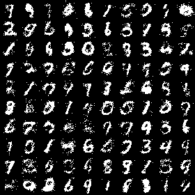
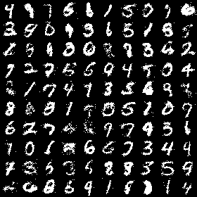

# remote-experiments-colab-cli

> POC de execução remota de experimentos de Machine Learning usando o [Google Colab CLI](https://github.com/googlecolab/colabtools).

Este repositório demonstra um fluxo completo de **desenvolvimento local + execução remota** no Google Colab, aplicado a um modelo clássico: um **Variational Autoencoder (VAE)** treinado sobre o dataset MNIST usando [JAX](https://github.com/jax-ml/jax).

## O que é esta POC?

A ideia é validar um workflow onde você:

1. **Desenvolve localmente** o código do experimento (modelo, dados, treino).
2. **Provisiona uma VM no Google Colab** (CPU, GPU ou TPU) via CLI.
3. **Faz upload do código** para a VM remota.
4. **Instala dependências** diretamente na VM.
5. **Executa o treinamento** de forma não interativa (via `colab exec` ou `colab console`).
6. **Baixa os artefatos gerados** (imagens, logs, checkpoints).
7. **Destroi a VM** para economizar compute units.

Tudo isso é orquestrado por um **Makefile** que encapsula os comandos do Colab CLI, tornando o fluxo reproduzível com poucos comandos.

---

## O modelo: VAE sobre MNIST

O código do VAE foi adaptado dos exemplos oficiais do JAX. Ele implementa:

- Um **encoder** com duas camadas densas (512 unidades, ReLU) que projeta as imagens 28x28 em uma distribuição Gaussiana diagonal (μ, σ²) no espaço latente de dimensão 10.
- Um **decoder** simétrico que reconstrói a imagem a partir de uma amostra do espaço latente.
- Otimização via **momentum SGD** com ELBO (Evidence Lower Bound) como função de perda.

A cada época, o treino salva uma grade 10x10 de imagens amostradas do modelo, permitindo visualizar a evolução da qualidade das gerações.

---

## Evolução do treino

Abaixo, amostras geradas pelo modelo nas épocas 0, 5 e 9 de um treino de 100 épocas em uma GPU T4 remota:

### Época 0 (ruído aleatório)



### Época 5 (começando a estruturar dígitos)



### Época 9 (padrões mais definidos)


---

## Pré-requisitos

- [uv](https://docs.astral.sh/uv/) — gerenciador de pacotes Python.
- [Google Colab CLI](https://github.com/googlecolab/colabtools) — `pip install google-colab`.
- [GitHub CLI](https://cli.github.com/) — `gh` (opcional, para criar o repo remoto).
- Uma conta Google com acesso ao Colab (compute units recomendadas para GPUs).

---

## Estrutura do repositório

```
.
├── Makefile                # Orquestra os comandos do Colab CLI
├── pyproject.toml          # Deps do projeto (uv)
├── README.md               # Este arquivo
├── assets/                 # Imagens geradas pelo VAE para o README
├── output/                 # Diretório local onde as imagens são baixadas
├── scripts/
│   └── colab_run.py        # Wrapper que executa `python -m vae` no remoto
└── src/
    └── vae/
        ├── __init__.py     # Pacote vae (vazio)
        ├── __main__.py     # Script principal de treino
        └── datasets.py     # Download e parsing do MNIST
```

---

## Como usar

### 1. Desenvolvimento local

Instale as dependências e execute o treino localmente (rápido para iterar no código):

```bash
uv sync
uv run -m vae
```

### 2. Execução remota no Colab

O `Makefile` encapsula o fluxo completo:

```bash
# Provisionar uma sessão com GPU T4
make colab-new-gpu

# Executar o fluxo completo: upload + instalar deps + treinar
make colab-all

# Baixar as imagens geradas para o diretório output/
make colab-download-images

# Destruir a VM (economiza compute units!)
make colab-stop
```

#### Comandos disponíveis

| Comando | Descrição |
|---------|-----------|
| `make colab-new` | Cria uma sessão Colab (CPU) |
| `make colab-new GPU=A100` | Cria uma sessão com GPU específica |
| `make colab-new-gpu` | Atalho para GPU T4 |
| `make colab-status` | Verifica se a VM está pronta |
| `make colab-upload` | Faz upload do pacote `src/vae/` para `/content/vae` |
| `make colab-install` | Instala `jax` e `matplotlib` na VM |
| `make colab-run` | Executa `python -m vae` via `colab console` |
| `make colab-run-exec` | Executa via `colab exec` com timeout de 1h (recomendado) |
| `make colab-download-images` | Baixa as imagens de `/tmp` na VM para `output/` |
| `make colab-logs` | Mostra os últimos 20 registros da sessão |
| `make colab-stop` | Encerra a sessão e libera compute units |
| `make colab-clean` | Encerra a sessão e remove imagens locais |
| `make colab-all` | Combo: upload + install + exec |

### 3. Por que `python -m vae`?

O script é executado como um **pacote Python** (`python -m vae`) para que o import relativo `from . import datasets` em `__main__.py` funcione corretamente. Isso evita o erro `ImportError: attempted relative import with no known parent package`.

O wrapper `scripts/colab_run.py` é usado pelo comando `colab exec -f` para replicar esse comportamento no ambiente remoto.

---

## Tecnologias

- [JAX](https://github.com/jax-ml/jax) — Computação numérica diferenciável com aceleração GPU/TPU.
- [Google Colab CLI](https://github.com/googlecolab/colabtools) — Provisionamento e execução remota.
- [uv](https://docs.astral.sh/uv/) — Gerenciamento de ambiente Python.
- [Matplotlib](https://matplotlib.org/) — Visualização das amostras geradas.

---

## Licença

O código do VAE é derivado dos exemplos oficiais do JAX, licenciados sob Apache 2.0.

---

## Autor

POC criada para validar workflows de ML remoto com Colab CLI.
